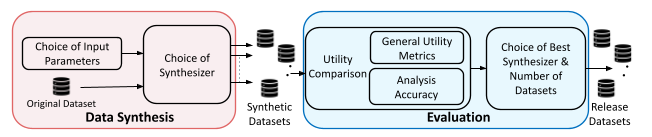

# Utility Assessment of Synthetic Data Generation Methods

> This repository contains the official implementation and the extended version of the paper: Utility Assessment of Synthetic Data Generation Methods

---

## Abstract

Big data analysis poses the dual problem of privacy preservation and utility, i.e., how accurate data analyses remain after transforming original data in order to protect the privacy of the individuals that the data is about - and whether they are accurate enough to be meaningful. In this paper, we thus investigate across several datasets whether different methods of generating fully synthetic data vary in their utility a priori (when the specific analyses to be performed on the data are not known yet), how closely their results conform to analyses on original data a posteriori, and whether these two effects are correlated. We find some methods (decision-tree based) to perform better than others across the board, sizeable effects of some choices of imputation parameters (notably number of released datasets), no correlation between broad utility metrics  and analysis accuracy, and varying correlations for narrow metrics. We did get promising findings for classification tasks when using synthetic data for training machine-learning models, which we consider worth exploring further also in terms of mitigating privacy attacks against ML models such as membership inference and model inversion.

  

---

# Extended Version of the Paper

The extended version of the Utility Assessment of Synthetic Data Generation Methods paper wih more detailed explanation about the experiments performed can be found using the following link

[Extended Version - Utility Assessment of Synthetic Data Generation Methods](https://github.com/sakib570/synthetic-data-utility/blob/main/Extended_Version_Utility_Assessment_of_Synthetic_Data_Generation_Methods.pdf)

---

# Paths

|Path | Description
| :--- | :---
├── ad-hoc-analysis
│   ├── adult_adhoc_analysis.ipynb| Ad hoc analysis experiments on Adult dataset
│   ├── avila_adhoc_analysis.ipynb | Ad hoc analysis experiments on Avila dataset
│   └── polish_adhoc_analysis.ipynb | Ad hoc analysis experiments on Polish dataset
├── classification-accuracy
│   ├── adult_classification.ipynb| Classification accuracy experiments on Adult dataset
│   ├── avila_classification.ipynb | Classification accuracy experiments on Avila dataset
│   └── polish_classification.ipynb | Classification accuracy experiments Polish dataset
├── correlation-test 
│   ├── adult_correlation_test.ipynb | Correlation tests on Adult dataset
│   ├── avila_correlation_test.ipynb | Correlation tests on Avila dataset
│   └── polish_correlation_test.ipynb | Correlation tests on Polish dataset
├── data
│   ├── original-datasets
│   ├── ├── adult_original_dataset.csv
│   ├── ├── adult_original_dataset.csv
│   └── └──adult_original_dataset.csv
│   ├── results-csv-files
│   ├── ├── adult_classification_accuracy.csv | Adult classification accuracy results
│   ├── ├── adult_correlation_data.csv | Data for correlation tests - Adult
│   ├── ├── adult_income_units_counts.csv | Count data for units income - Adult
│   ├── ├── avila_classification_accuracy.csv | Avila classification accuracy results
│   ├── ├── avila_correlation_data.csv | Data for correlation tests - Avila
│   ├── ├── avila_author_class_units_counts.csv | Count data for units author class - Avila
│   ├── ├── polish_classification_accuracy.csv | Polish classification accuracy results
│   ├── ├── polish_correlation_data.csv | Data for correlation tests - Polish
│   ├── ├── polish_income_units_counts.csv  | Count data for units income - Polish
├── general-utility-metrics 
│   ├── avg_cio_apo_kl_dv_cal_and_plot.R | Calculation and plots of CIO, APO & KL-divergence
│   ├── lib_avg_cio_apo_kl_dv.R | Library functions for CIO, APO & KL-divergence
│   ├── lib_cio_and_variance.R | Library functions for comparing CIO & calculating variance
│   ├── lib_synthesizers_reg_fit_meanp_est.R | Library functions regression fit, mean point estimation, & different synthesizers 
│   ├── synthesizers.R | General function for synthesizers
│   └── synthetic_data_gen_reg_fit_meanp_est.R | Synthetic data generation, regression and mean point estimation coefficients calculation 
├── plots | Figures for different experiments
├── Extended_Version_Utility...Methods.pdf| Extended version of the paper
└── README.md
---